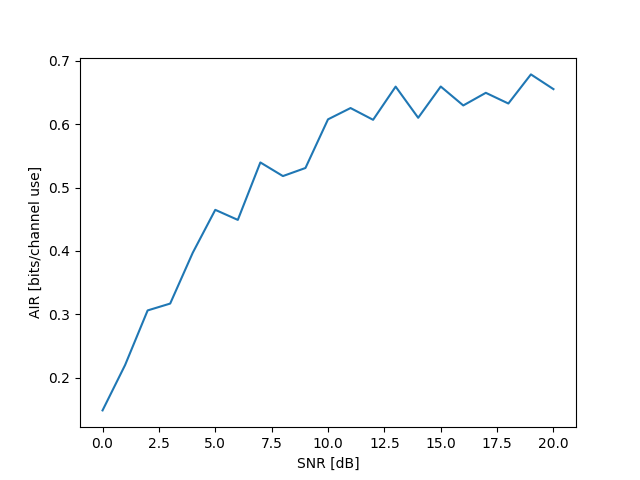
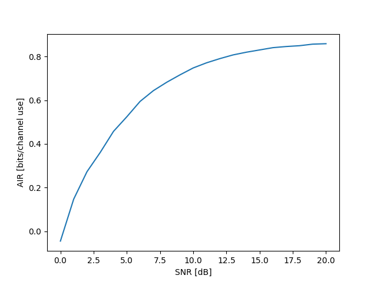

# AIR vs SNR Performance Comparison: Analytical Solution vs Neural Network-Based Detector

This repository contains the results and analysis of the Average Information Rate (AIR) vs Signal-to-Noise Ratio (SNR) performance comparison between two detection methods:

1. **Analytical Solution (Sum-Product Based Soft-Output Detector)**
2. **Neural Network (NN)-Based Soft-Output Detector**

## Overview

The two approaches are evaluated to measure the AIR under varying SNR conditions. Below, we provide the description of both methods and their respective performances.

---

## Methods

### 1. Neural Network-Based Soft-Output Detector
- **Description**: A data-driven method using a neural network (NN) trained with specific hyperparameters to compute soft outputs for decoding.
- **Key Parameters**:
  - Number of epochs: 500
  - Training samples: \(2^{12}\)
  - Beta: 1.6
  - Hidden layers: Two, with 10 neurons each
  - Activation: Softmax for generating a probability distribution at the output
- **Performance**: As shown in the graph, the AIR performance gradually increases with SNR, reaching a plateau around 0.7 bits per channel use.



### 2. Analytical Solution (Sum-Product Based Soft-Output Detector)
- **Description**: A mathematical approach leveraging known channel statistics and the Sum-Product Algorithm to calculate the AIR.
- **Advantages**:
  - Provides stable and consistent results.
  - Utilizes the Gaussian-Markov channel process for accurate estimations.
- **Performance**: This approach exhibits superior performance compared to the NN-based method, with the AIR approaching the theoretical limit of 1 bit per channel use for Binary Phase-Shift Keying (BPSK).



---

## Performance Comparison

| Metric            | Neural Network-Based Detector | Analytical Solution         |
|--------------------|--------------------------------|------------------------------|
| **Complexity**     | Requires training on large datasets | Computational but no training |
| **AIR at High SNR**| ~0.7 bits/channel use         | ~1 bit/channel use           |
| **Stability**      | Somewhat unstable, oscillations at high SNR | Highly stable across SNRs    |
| **Dependence**     | Data-dependent                | Independent of training data |

---

## Conclusion

- The **Sum-Product Based Soft-Output Detector** achieves higher and more stable AIR across all SNR levels compared to the neural network-based approach.
- While the NN-based detector is promising, its performance is currently limited by data-dependence and training complexity.

---

## How to Use This Repository

- Clone this repository:
   ```bash
   git clone https://github.com/z3rd3n/soft-output-detector-comparison.git
   ```


---

## Authors

For detailed derivations and methods, please refer to the accompanying [report](soft_decoder_report.pdf).

--- 

Feel free to copy and adjust this structure as needed for your GitHub repository! Let me know if you'd like any additional sections or modifications.
